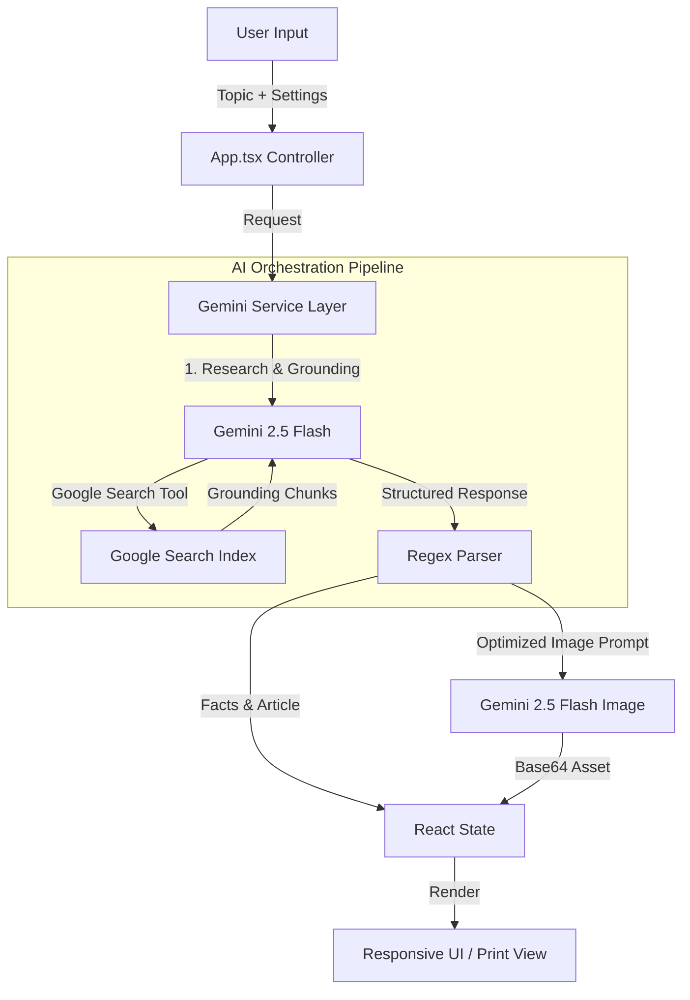

# InfoGenius Free

[](https://fabioarieira.com)
[](https://react.dev)
[](https://ai.google.dev)
[](https://fabioarieira.com)

> **Visual Knowledge Engine powered by Multimodal AI.**
> Desenvolvido por **Fabio Arieira** | [fabioarieira.com](https://fabioarieira.com)

---

## 📑 Visão Geral da Arquitetura

O **InfoGenius Free** é uma Single Page Application (SPA) reativa construída sobre o ecossistema React 19, utilizando uma arquitetura **Serverless Client-Side**. A aplicação atua como uma interface de orquestração multimodal, comunicando-se diretamente com a API do Google Gemini via SDK `@google/genai`.

O núcleo do sistema opera em um pipeline de **RAG (Retrieval-Augmented Generation)** simplificado, utilizando a ferramenta nativa `googleSearch` do Gemini para *grounding* (fundamentação) factual, seguido por uma cadeia de geração de prompts estruturados para síntese visual e textual.

### Diagrama de Fluxo de Dados



---

## 🛠 Tech Stack & Dependências

*   **Core**: React 19.2.0 (Hooks pattern), ReactDOM.
*   **Language**: TypeScript (Strict typing, Interfaces para DTOs).
*   **Styling**: Tailwind CSS (Utility-first, Dark Mode nativo, Print modifiers).
*   **AI Integration**: Google GenAI SDK (`@google/genai` v1.29.0).
*   **Icons**: Lucide React.
*   **Persistence**: `localStorage` para chaves API e preferências de idioma.

---

## ⚙️ Detalhamento Técnico dos Módulos

### 1. Camada de Serviço (`geminiService.ts`)

Esta é a camada crítica da aplicação, responsável pela abstração da comunicação com a API.

#### 1.1. Estratégia de Rotação de Chaves (Fault Tolerance)
A aplicação implementa um padrão de *Round-Robin* com *Retry Pattern* para gerenciar limites de cota (Rate Limiting - HTTP 429) no lado do cliente.

*   **Lógica**: O sistema mantém um array de chaves personalizadas (`customKeys`).
*   **Execução**: A função wrapper `executeWithRetry` encapsula todas as chamadas. Se uma chamada falha com erros recuperáveis (`429`, `403`, `QuotaExceeded`), o iterador rotaciona para a próxima chave disponível e reexecuta a operação de forma transparente para o usuário.

#### 1.2. Engenharia de Prompt e Parsing
A função `researchTopicForPrompt` utiliza uma técnica de **Chain-of-Thought (CoT)** implícita com saída estruturada.

*   **Input**: Tópico, Nível de Complexidade (Audience), Estilo Visual, Idioma.
*   **System Instruction**: Instrui o modelo a atuar como um pesquisador visual.
*   **Tool Use**: Ativação obrigatória de `{ googleSearch: {} }` para garantir precisão factual.
*   **Output Parsing**: O modelo é instruído a retornar blocos delimitados (`FACTS:`, `ARTICLE:`, `IMAGE_PROMPT:`). O frontend utiliza Expressões Regulares (Regex) para extrair esses blocos e tipá-los na interface `ResearchResult`.

```typescript
// Exemplo de Parsing Regex utilizado
const factsMatch = text.match(/FACTS:\s*([\s\S]*?)(?=ARTICLE:|IMAGE_PROMPT:|$)/i);
const articleMatch = text.match(/ARTICLE:\s*([\s\S]*?)(?=IMAGE_PROMPT:|$)/i);
```

### 2. Geração e Manipulação de Imagens

*   **Modelo**: `gemini-2.5-flash-image`.
*   **Geração**: Utiliza o prompt otimizado gerado no passo de pesquisa anterior.
*   **Edição (In-painting/Instruction-based)**: A função `editInfographicImage` envia a imagem atual (Base64 sanitizado) de volta ao modelo com uma instrução de linguagem natural (ex: "Mude o fundo para azul"). O modelo retorna uma nova imagem mantendo a coerência estrutural da original.

### 3. Internacionalização (i18n)

O sistema de tradução (`translations.ts`) não utiliza bibliotecas externas pesadas. Baseia-se em um objeto dicionário tipado indexado por `UiLanguage` ('pt' | 'en' | 'es'). Isso garante performance máxima (Zero-runtime overhead) e type-safety total no TypeScript.

### 4. Interface e Acessibilidade

*   **Dark Mode**: Implementado via classe `dark` no elemento raiz e variáveis CSS do Tailwind.
*   **Print Stylesheets**: Utilização extensiva de `@media print` para transformar a aplicação web em um relatório científico limpo (removendo navegação, botões e formulários) ao acionar a função de impressão do navegador.

---

## 📂 Estrutura de Arquivos

```
/
├── index.html              # Entry point, importmaps, CDN links
├── index.tsx               # Bootstrapping React
├── App.tsx                 # Controller principal, State Management, Routing lógico
├── translations.ts         # Dicionários de internacionalização
├── types.ts                # Definições de Interfaces (DTOs) e Types
├── services/
│   └── geminiService.ts    # Lógica de negócios AI e API Client
└── components/
    ├── ArticleSection.tsx  # Renderizador Markdown e Layout de Impressão
    ├── Infographic.tsx     # Viewer de imagem com controles de Zoom/Pan
    ├── IntroScreen.tsx     # Animações CSS3/Keyframes complexas
    ├── Loading.tsx         # Feedback visual reativo
    └── SearchResults.tsx   # Display de metadados de grounding (URLs)
```

---

## 🚀 Como Executar

A aplicação foi desenhada para ser agnóstica de build tools complexos em seu formato atual (utilizando ES Modules via browser).

### Pré-requisitos
*   Um servidor web estático simples (ex: Live Server do VS Code, Python SimpleHTTPServer, ou Vite).
*   Chave de API do Google Gemini (Pode ser gerada no [Google AI Studio](https://aistudio.google.com/)).

### Instalação

1.  Clone o repositório:
    ```bash
    git clone https://github.com/fabioarieira/infogenius-free.git
    ```
2.  Navegue até o diretório:
    ```bash
    cd infogenius-free
    ```
3.  Sirva os arquivos. Exemplo com Python:
    ```bash
    python3 -m http.server 8000
    ```
4.  Acesse `http://localhost:8000` no navegador.

---

## 🛡️ Licença e Autoria

**Autor**: Fabio Arieira
**Site**: [fabioarieira.com](https://fabioarieira.com)

Este projeto é distribuído sob a licença **Apache 2.0**.
O uso da API do Google Gemini está sujeito aos termos de serviço do Google AI.

---

<p align="center">
  <sub>Desenvolvido com excelência técnica por Fabio Arieira.</sub>
</p>
